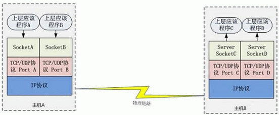

# What Is Socket ?

Socket 不是协议，工作在 OSI 模型会话层（第5层），
为了方便大家直接使用更底层协议（一般是 TCP 或 UDP ）而存在的一个抽象层。

最早的一套 Socket API 是 Berkeley sockets ，采用 C 语言实现。
它是 Socket 的事实标准，POSIX sockets 是基于它构建的，
多种编程语言都遵循这套 API，在 JAVA、Python 中都能看到这套 API 的影子。

Socket是应用层与TCP/IP协议族通信的中间软件抽象层，它是一组接口。
在设计模式中，Socket其实就是一个门面模式，它把复杂的TCP/IP协议族隐藏在Socket接口后面，
对用户来说，一组简单的接口就是全部，让Socket去组织数据，以符合指定的协议。

  

主机 A 的应用程序要能和主机 B 的应用程序通信，必须通过 Socket 建立连接，  
而建立 Socket 连接必须需要底层 TCP/IP 协议来建立 TCP 连接。  
建立 TCP 连接需要底层 IP 协议来寻址网络中的主机。  
我们知道网络层使用的 IP 协议可以帮助我们根据 IP 地址来找到目标主机，  
但是一台主机上可能运行着多个应用程序，如何才能与指定的应用程序通信就要通过 TCP 或 UPD 的地址也就是端口号来指定。  
这样就可以通过一个 Socket 实例唯一代表一个主机上的一个应用程序的通信链路了。  

## vs. TCP/IP

TCP/IP只是一个协议栈，就像操作系统的运行机制一样，必须要具体实现，同时还要提供对外的操作接口。
这个就像操作系统会提供标准的编程接口，比如win32编程接口一样，
TCP/IP也要提供可供程序员做网络开发所用的接口，这就是Socket编程接口。

TCP/IP只是一个协议栈
	就像操作系统的运行机制一样，必须要具体实现
	同时还要提供对外的操作接口
就像操作系统会提供标准的编程接口
	比如Win32编程接口一样
	TCP/IP也必须对外提供编程接口，这就是Socket
Socket跟TCP/IP并没有必然的联系
	Socket编程接口在设计的时候，就希望也能适应其他的网络协议
	所以，Socket的出现只是可以更方便的使用TCP/IP协议栈而已
	其对TCP/IP进行了抽象，形成了几个最基本的函数接口
		比如create，listen，accept，connect，read和write等等。
不同语言都有对应的建立Socket服务端和客户端的库
